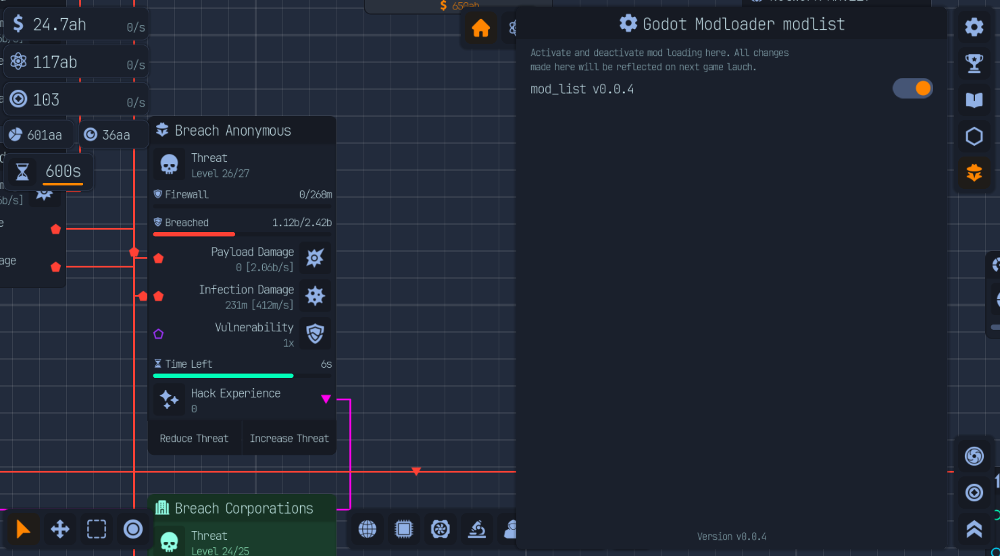

# Godot Modloader modlist for Upload Labs

## Description

Adds a news menu listing all your active mods loaded with the godot mod loader.

Allows you to confirm that a mod is really active and to deactivate some of them.

## Installation

Add the .zip file from the latest release in your games /mods folder.

## Requirement

You need to have the godot modloader setuped on your game.

More info at [Mod loader self setup](https://wiki.godotmodding.com/guides/integration/mod_loader_self_setup/)

## Maybe

If it picks up, I could link the Modloader config api too, to allow easy config editing but for now my mods don't use it.